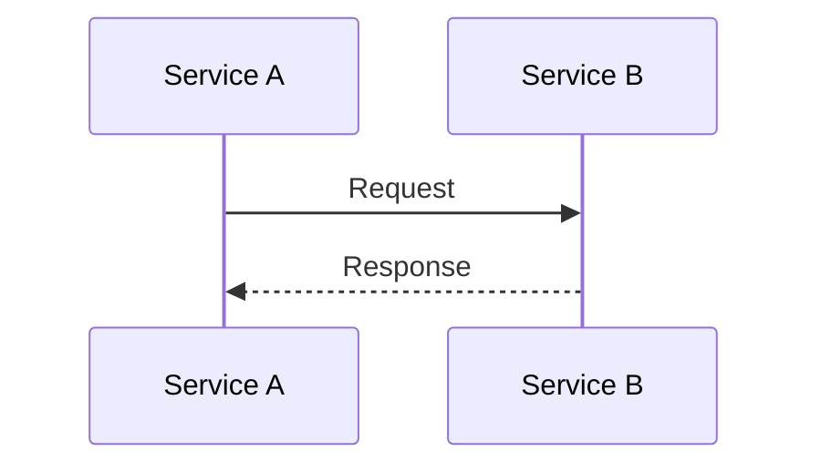

# [ISSUE_KEY]: [Title]

## 1. Context & Problem

### 1.1 Problem Statement

* **Current Behavior:** (What is broken/inefficient?)
* **Impact:** (Business impact/Technical debt)
* **Root Cause:** (Technical explanation)

### 1.2 Proposed Solution

* **Summary:** [One sentence architecture summary]
* **Key Decisions:** [Why Redis? Why Async?]

---

## 2. Business Requirements

| ID | Requirement Description | Acceptance Criteria |
|:---|:------------------------|:--------------------|
| FR-1 | ... | ... |

---

## 3. Technical Implementation

### 3.1 Architectural Design

* **Design Pattern:** (e.g., Strategy Pattern for Payment methods)
* **Component Interaction:** (Sequence of events)
    1. Service A calls Service B (Sync/Async?)
    2. Service B publishes Event X...

* **Diagram:** (If needed)

### 3.2 Data Model Changes

| Table | Column | Type | Nullable | Default | Description |
|:------|:-------|:-----|:---------|:--------|:------------|
| TBL-1 | CLMN-1 | BIT  | FALSE    | 1/0/-   | Desc        |

* **Performance Analysis:**
    * Target Table Volume: (e.g., Currently 50M rows, growing 100k/day)
    * Indexing Strategy: (Explain WHY)
    * Cleanup/Archival: (TTL requirements)

### 3.3 API Contract

* **Swagger/OpenAPI Link:** (If exists)
* **Endpoint:** `METHOD /path/to/resource`
* **Idempotency:** (Yes/No. If Yes, how?)
* **Validation Rules:**
    * field_a: Not Null, Regex `^[a-z]+$`
    * amount: Positive Integer
* **Error Codes:** (4xx, 5xx handling)

### 3.4 Configuration & Feature Flags

* **Feature Flags:** (e.g., `ENABLE_NEW_FLOW`: Default FALSE)
* **System Parameters:** (e.g., `MAX_RETRY`: 3, `TIMEOUT`: 2000ms)
* **Secret Management:** (New keys required? Vault path?)

### 3.5 Security & Compliance

* **Authentication/Authorization:** (Required Scopes/Roles)
* **PII/Data Privacy:** (Sensitive data? Masking in logs?)
* **Rate Limiting:** (Public endpoint? Limit?)

---

## 4. Non-Functional Requirements (NFRs)

*Be specific. No generic statements.*

* **Throughput:** (e.g., Support 500 TPS peak)
* **Latency:** (e.g., p99 < 200ms)
* **Consistency:** (Eventual vs. Strong)
* **Observability:**
    * **Key Metrics:** (e.g., `payment.success.count`, `api.latency.timer`)
    * **Alerts:** (e.g., Alert if 5xx > 1% for 5 mins)
    * **Logs:** (If necessary)

---

## 5. Risks & Mitigation Strategies

| Risk | Probability | Impact | Mitigation Strategy |
|:-----|:------------|:-------|:--------------------|
| Third-party API down | Low | High | Circuit Breaker |

---

## 6. Error Messages

| Code | Message | Description |
|:-----|:--------|:------------|
| `<code>` | `<message>` | `<description>` |

---

## 7. Test Scenarios

### 7.1 Positive Cases

* [ ] Case 1: Description
* [ ] Case 2: Description

### 7.2 Negative Cases

* [ ] Case 1: Description
* [ ] Case 2: Description

### 7.3 Edge Cases

* [ ] Case 1: Description

---

## 8. Definition of Done (DoD)

* [ ] Unit Tests (Coverage > 80%)
* [ ] Integration Tests (Happy + Sad + Edge)
* [ ] Performance Benchmarks met
* [ ] Security Scan Passed
* [ ] Documentation Updated

---

## 9. Deployment & Rollback Strategy

### 9.1 Rollout Plan

* **Database Migration:** (Flyway/Liquibase version)
* **Backfill Strategy:** (Old data population? Script link?)
* **Deployment Steps:** (Canary? Blue/Green?)

### 9.2 Rollback Plan

* **Code Revert:** (Git revert strategy)
* **Data Revert:** (Backward compatible? Data fix?)
