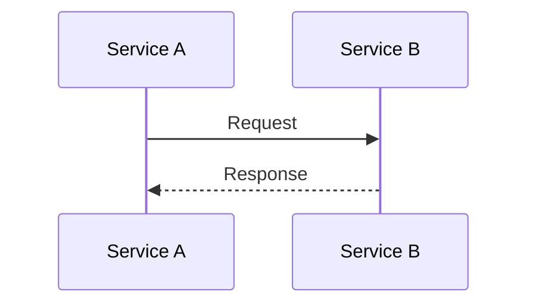

# [ISSUE_KEY]: [Başlık]

## 1. Bağlam & Problem

### 1.1 Problem Tanımı

* **Mevcut Durum:** (Ne bozuk/verimsiz?)
* **Etki:** (İş etkisi/Teknik borç)
* **Kök Neden:** (Teknik açıklama)

### 1.2 Önerilen Çözüm

* **Özet:** [Tek cümlelik mimari özeti]
* **Temel Kararlar:** [Neden Redis? Neden Async?]

---

## 2. İş Gereksinimleri

| ID | Gereksinim Açıklaması | Kabul Kriterleri |
|:---|:----------------------|:-----------------|
| FR-1 | ... | ... |

---

## 3. Teknik Implementasyon

### 3.1 Mimari Tasarım

* **Design Pattern:** (örn., Ödeme yöntemleri için Strategy Pattern)
* **Component Etkileşimi:** (Olay sırası)
    1. Service A, Service B'yi çağırır (Sync/Async?)
    2. Service B, Event X'i publish eder...

* **Diyagram:** (Gerekirse)

### 3.2 Veri Modeli Değişiklikleri

| Tablo | Kolon | Tip | Nullable | Default | Açıklama |
|:------|:------|:----|:---------|:--------|:---------|
| TBL-1 | CLMN-1 | BIT | FALSE | 1/0/- | Açıklama |

* **Performans Analizi:**
    * Hedef Tablo Hacmi: (örn., Şu an 50M satır, günde 100k büyüyor)
    * Index Stratejisi: (NEDEN olduğunu açıkla)
    * Temizlik/Arşivleme: (TTL gereksinimleri)

### 3.3 API Contract

* **Swagger/OpenAPI Link:** (Varsa)
* **Endpoint:** `METHOD /path/to/resource`
* **Idempotency:** (Evet/Hayır. Evet ise nasıl?)
* **Validation Kuralları:**
    * field_a: Not Null, Regex `^[a-z]+$`
    * amount: Pozitif Integer
* **Error Kodları:** (4xx, 5xx handling)

### 3.4 Konfigürasyon & Feature Flag'ler

* **Feature Flag'ler:** (örn., `ENABLE_NEW_FLOW`: Default FALSE)
* **Sistem Parametreleri:** (örn., `MAX_RETRY`: 3, `TIMEOUT`: 2000ms)
* **Secret Yönetimi:** (Yeni key gerekli mi? Vault path?)

### 3.5 Güvenlik & Uyumluluk

* **Authentication/Authorization:** (Gerekli Scope/Roller)
* **PII/Veri Gizliliği:** (Hassas veri? Log'larda maskeleme?)
* **Rate Limiting:** (Public endpoint mi? Limit?)

---

## 4. Fonksiyonel Olmayan Gereksinimler (NFR)

*Spesifik ol. Genel ifadeler kullanma.*

* **Throughput:** (örn., 500 TPS peak desteği)
* **Latency:** (örn., p99 < 200ms)
* **Consistency:** (Eventual vs. Strong)
* **Observability:**
    * **Key Metrikler:** (örn., `payment.success.count`, `api.latency.timer`)
    * **Alert'ler:** (örn., 5xx > %1 ise 5 dk için alert)
    * **Log'lar:** (Gerekirse)

---

## 5. Riskler & Azaltma Stratejileri

| Risk | Olasılık | Etki | Azaltma Stratejisi |
|:-----|:---------|:-----|:-------------------|
| Third-party API down | Düşük | Yüksek | Circuit Breaker |

---

## 6. Hata Mesajları

| Kod | Mesaj | Açıklama |
|:----|:------|:---------|
| `<kod>` | `<mesaj>` | `<açıklama>` |

---

## 7. Test Senaryoları

### 7.1 Pozitif Case'ler

* [ ] Case 1: Açıklama
* [ ] Case 2: Açıklama

### 7.2 Negatif Case'ler

* [ ] Case 1: Açıklama
* [ ] Case 2: Açıklama

### 7.3 Edge Case'ler

* [ ] Case 1: Açıklama

---

## 8. Tamamlanma Tanımı (DoD)

* [ ] Unit Test'ler (Coverage > %80)
* [ ] Integration Test'ler (Happy + Sad + Edge)
* [ ] Performans Benchmark'ları karşılandı
* [ ] Güvenlik Taraması Geçti
* [ ] Dokümantasyon Güncellendi

---

## 9. Deploy & Rollback Stratejisi

### 9.1 Rollout Planı

* **Database Migration:** (Flyway/Liquibase versiyonu)
* **Backfill Stratejisi:** (Eski veri doldurma? Script linki?)
* **Deploy Adımları:** (Canary? Blue/Green?)

### 9.2 Rollback Planı

* **Code Revert:** (Git revert stratejisi)
* **Data Revert:** (Geriye uyumlu mu? Veri düzeltme?)
