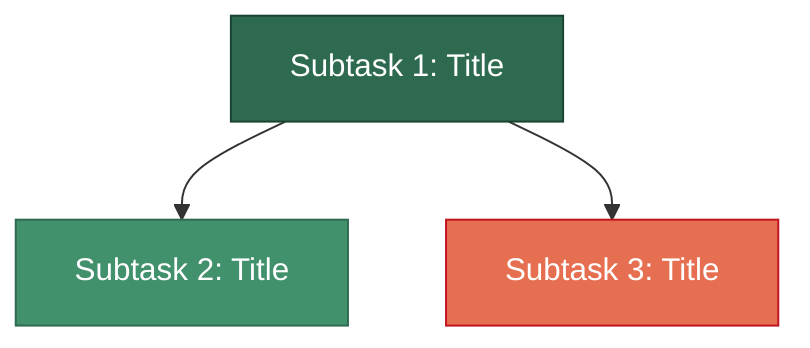
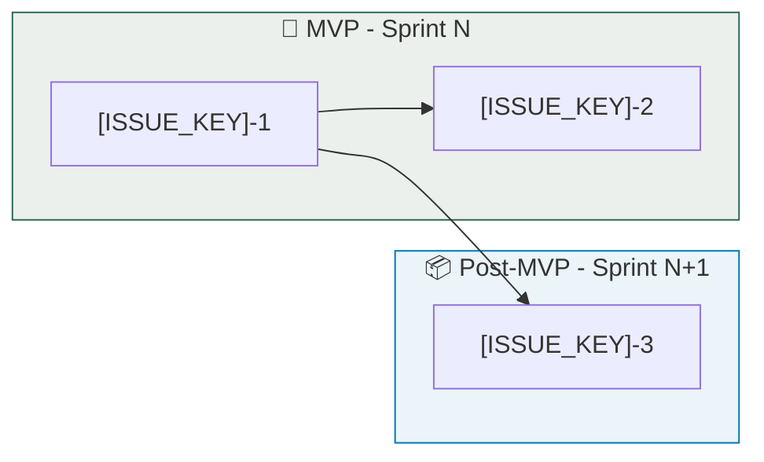

# [ISSUE_KEY]: Agile Story Breakdown

## Decision: Single Story or Split?

> [!CAUTION]
> **Verdict.** [Must be split / Can remain single] — [One-line rationale]

### Evaluation Criteria

| Criterion | Assessment |
|:----------|:-----------|
| **Independent deploy** | [Can components be deployed separately?] |
| **Risk profile** | [Do all parts carry the same risk?] |
| **Testability** | [Can each part independently reach Done?] |
| **Sprint capacity** | [Estimated effort vs. sprint capacity] |
| **INVEST compliance** | [Which INVEST dimensions fail as single story?] |

---

## Story Map (Dependency Graph)

> [!IMPORTANT]
> [Critical ordering constraints, if any]

---

## Sprint Planning

### Sprint N: [Theme]

| Subtask | Title | SP | Risk | Phases |
|:--------|:------|:---|:-----|:-------|
| **[ISSUE_KEY]-1** | [Title] | **N** | [Low/Medium/High] | Analysis X day, Dev Y day, Test Z day |
| **[ISSUE_KEY]-2** | [Title] | **N** | [Low/Medium/High] | Analysis X day, Dev Y day, Test Z day |

### Sprint N+1: [Theme]

| Subtask | Title | SP | Risk | Phases |
|:--------|:------|:---|:-----|:-------|
| **[ISSUE_KEY]-3** | [Title] | **N** | [Low/Medium/High] | Analysis X day, Dev Y day, Test Z day |

---

## Story Details

---

### [ISSUE_KEY]-1: [Title]

**Type:** Story | **SP:** N | **Risk:** [Low/Medium/High] | **Priority:** P0

**Dependency:** None (Foundation)

**Description:**
[One paragraph: what this story delivers end-to-end]

**Analysis:**
- [Analysis task 1]
- [Analysis task 2]

**Development:**
- [Development task 1]
- [Development task 2]

**Acceptance Criteria:**
- [ ] [Criterion 1]
- [ ] [Criterion 2]
- [ ] [Criterion 3]

**DoD:** [One-line: what "done" means for this story]

---

### [ISSUE_KEY]-2: [Title]

**Type:** Story | **SP:** N | **Risk:** [Low/Medium/High] | **Priority:** P0

**Dependency:** [ISSUE_KEY]-1 ✅

**Description:**
[One paragraph: what this story delivers end-to-end]

**Analysis:**
- [Analysis task 1]

**Development:**
- [Development task 1]
- [Development task 2]

**Acceptance Criteria:**
- [ ] [Criterion 1]
- [ ] [Criterion 2]

**DoD:** [One-line: what "done" means for this story]

---

## MVP Scope

> [!TIP]
> **MVP = [ISSUE_KEY]-1 + [ISSUE_KEY]-2** → [One-line MVP outcome]

| Tier | Stories | Outcome |
|:-----|:--------|:--------|
| **MVP (Must Have)** | [ISSUE_KEY]-1, [ISSUE_KEY]-2 | [What the MVP delivers] |
| **Post-MVP (Should Have)** | [ISSUE_KEY]-3 | [What post-MVP adds] |
| **Tech Debt (Nice to Have)** | [ISSUE_KEY]-N | [Cleanup scope] |

---

## Effort Summary

| Metric | Value |
|:-------|:------|
| **Total Story Points** | **N SP** |
| **MVP Story Points** | **N SP** |
| **Minimum Sprints** | N (ideal), N (safe) |
| **Highest Risk Story** | [ISSUE_KEY]-N ([reason]) |
| **Deploy Order** | S1 → S2 → S3 → ... |
